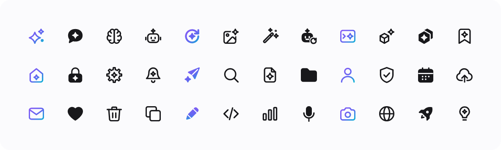

# AI Icon Pack

**1,178 icons that look like they were made for AI apps.** They share one soft, rounded "Spark" style, where the 4-point spark marks anything AI. Every icon comes in **outline and filled**, as **SVG and PNG**, with an optional **AI gradient**. The pack ships as an **Agent Skill**, so Claude (or any agent) can search it and drop icons straight into your project.

**[Browse the icons →](https://djtoon.github.io/ai-icon-pack/)**



## Install

### Claude Code (recommended)

```bash
claude plugin marketplace add djtoon/ai-icon-pack
claude plugin install ai-icon-pack@ai-icon-pack
```

Or from inside a Claude Code session: `/plugin marketplace add djtoon/ai-icon-pack`, then `/plugin install ai-icon-pack@ai-icon-pack`.

Then just ask: *"add regenerate and stop buttons to the chat input using the AI icon pack"*. The skill also loads on its own whenever you need icons.

### Manual skill install

Download **[ai-icon-pack-skill.zip](https://djtoon.github.io/ai-icon-pack/downloads/ai-icon-pack-skill.zip)**, unzip it, and move the `ai-icon-pack` folder to:

- `~/.claude/skills/ai-icon-pack/` for every project, or
- `.claude/skills/ai-icon-pack/` for one project (commit it so your team gets it).

```bash
git clone https://github.com/djtoon/ai-icon-pack.git
cp -r ai-icon-pack/plugins/ai-icon-pack/skills/ai-icon-pack ~/.claude/skills/
```

### claude.ai and Claude Desktop

Download [ai-icon-pack-skill.zip](https://djtoon.github.io/ai-icon-pack/downloads/ai-icon-pack-skill.zip). Then go to **Settings → Capabilities**, turn on code execution, and choose **Skills → Upload skill** with the zip.

### Claude API

```python
import anthropic
from anthropic.lib import files_from_dir

client = anthropic.Anthropic()
skill = client.skills.create(files=files_from_dir("ai-icon-pack"))  # the unzipped skill folder
# then pass container={"skills": [{"type": "custom", "skill_id": skill.id, "version": "latest"}]}
# together with the code execution tool on messages.create
```

### Other agents

The skill uses the open `SKILL.md` format: a folder with instructions, a zero-dependency Node script and the SVGs. Copy `plugins/ai-icon-pack/skills/ai-icon-pack/` into your agent's skills directory. The script also works on its own (see below).

### Just the icons

- **[All SVGs (zip)](https://djtoon.github.io/ai-icon-pack/downloads/ai-icon-pack-svg.zip)**: outline, filled and AI gradient.
- **Single SVG or PNG at any size and colour:** use the [gallery](https://djtoon.github.io/ai-icon-pack/). It can also zip PNGs of the icons currently shown.
- **Every PNG size, built locally:** `npm install && npm run build` writes `dist/png/{black,white,gradient}/{16…512}/`.

## Using the skill's script

Your agent drives this for you, but you can run it yourself (Node 18+). Run it from the skill folder, or point at `scripts/icons.mjs` with a full path.

```bash
node scripts/icons.mjs search "ai chat"                 # ranked by meaning, synonyms built in
node scripts/icons.mjs add chat-sparkle regenerate stop-generating \
     --out src/components/icons --format react --style both
node scripts/icons.mjs add sparkles bot --out public/icons --format png --size 32,512 --gradient
node scripts/icons.mjs show lock --style filled          # print raw SVG
```

| `add` option | values | default |
|---|---|---|
| `--format` | `svg`, `png`, `react`, `vue`, `sprite` | `svg` |
| `--style` | `outline`, `filled`, `both` | `outline` |
| `--gradient` | bake in the violet → cyan AI gradient | off |
| `--color` | CSS colour baked into SVG/PNG | `currentColor` |
| `--size` | PNG size(s), e.g. `24,48,512` | `24` |
| `--jsx` | React `.jsx` instead of `.tsx` | off |

PNG output uses `@resvg/resvg-js`. If it isn't installed, the script prints the one-line command to add it.

## The style

- **Grid:** 24×24, 1.75 rounded strokes, soft corners, `currentColor`.
- **Spark means AI.** AI icons carry a large spark (`chat-sparkle`, `ai-search`, `file-sparkle`, `regenerate`…). Everyday icons get a small accent spark only where it replaces a natural detail: the door of `home`, the keyhole of `lock`, the axle of `settings`. Plain counterparts (`chat`, `search`, `file`, `user`) stay spark-free, so "human" and "AI" read differently.
- **Variants:** modifiers sit in a bottom-right badge (`-plus`, `-check`, `-lock`…), and `-off` icons use a diagonal slash.
- **Filled style:** the same silhouette as the outline, with interior details cut out.

The full rules are in [STYLE.md](STYLE.md), and every icon with its drawing hint is in [ICONS.md](ICONS.md).

## Contributing

See [CONTRIBUTING.md](CONTRIBUTING.md). Icons are hand-authored SVG in `src/icons/*.mjs`. `npm run check -- <NN>` renders a review sheet, and `npm run package` refreshes the skill and the site.

## License

[MIT](LICENSE). Use the icons in personal and commercial projects; attribution is appreciated but not required.
